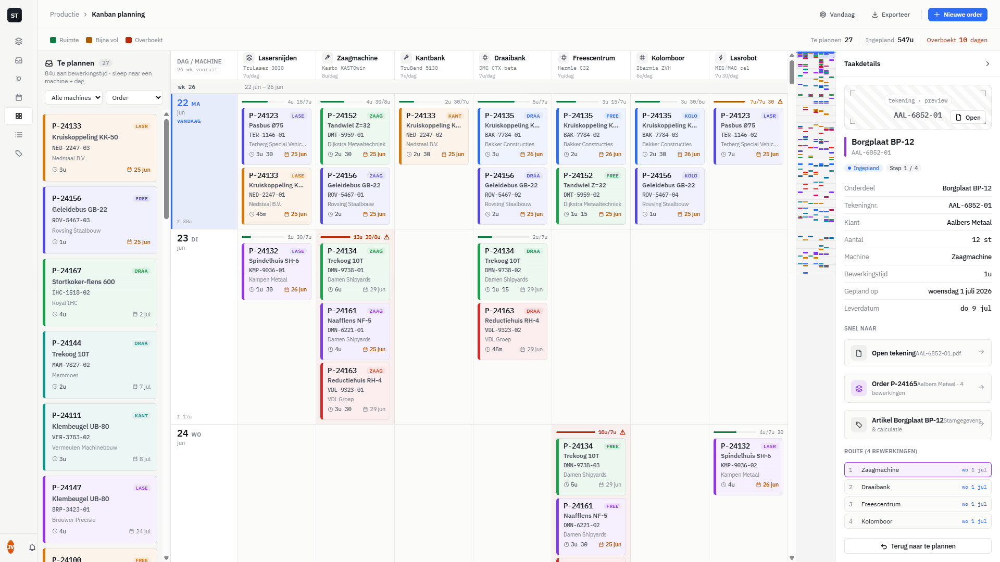

# Handoff: Kanban Production Planner (StaalTrack)

> A drag‑and‑drop production planning board for a steel/metalworking shop.
> **Machine columns × workday rows**, a *Te plannen* (to‑plan) backlog on the
> left, a VS Code–style vertical **minimap** that doubles as the scrollbar, and
> a collapsible **details** panel on the right. Dutch‑language UI.

---

## About the design files

The files in this bundle are **design references implemented in HTML/CSS + React
(via in‑browser Babel)**. They are a working hi‑fi prototype that shows the
intended look, layout, data model, and behavior — **not** production code to ship
as‑is.

**Your task:** recreate this design inside the target codebase using its existing
environment, patterns, and component library (React, Vue, Svelte, SwiftUI,
native, …). If no environment exists yet, pick the most appropriate framework
and implement it there. The prototype uses plain React with global components
loaded via `<script>` tags and CSS custom properties — in a real app you would
use proper modules, a component library, and a real data layer.

This document is written to be **self‑sufficient**: a developer who was not in
the original conversation should be able to rebuild the feature from this README
alone. Nothing about the design should be lost.

## Fidelity

**High‑fidelity.** Final colors, typography, spacing, capacity logic, drag‑drop
behavior, the minimap algorithm, and the selection treatments are all specified
exactly below. Recreate the UI faithfully using the codebase's libraries.

---

## Context & domain

This screen belongs to **StaalTrack**, a steel inventory + production app. There
is already a Gantt‑style "Planning" board in the same app; this is a **second,
complementary view**: a Kanban planner where the planner drags production steps
("bewerkingen") onto a machine + a day.

Domain vocabulary (Dutch → English):

| Dutch | Meaning |
|---|---|
| Te plannen | To be planned / backlog |
| Order / productienummer | Production order number (e.g. `P-24123`) |
| Onderdeel / artikel | Part / article |
| Tekening(nummer) | (Engineering) drawing number |
| Klant | Customer |
| Leverdatum | Delivery / due date |
| Bewerking / stap | Machining operation / step |
| Bewerkingstijd / duur | Machining time / duration |
| Machine | Machine (the columns) |
| Capaciteit | Capacity |
| Overboekt | Overbooked (capacity exceeded) |
| Bezetting | Utilization |
| Werkdag | Workday (Mon–Fri) |
| Vandaag | Today |

The mental model: **a part (order) has a route of steps**, each step runs on one
machine for a known time. The planner schedules each step into a `(machine, day)`
cell. Each machine‑day has finite capacity; overbooking raises a warning.

---

## Overall layout



> *Reference screenshot (`screenshot-board.png`). Captured at ~920px wide, so the
> machine columns are compressed and the board scrolls horizontally; on a wide ops
> display the 7 machine columns stretch to fill. Left→right: sidebar · Te plannen
> backlog · board · minimap · details panel.*

Full‑viewport app shell (`height:100vh; width:100vw; overflow:hidden`):

```
┌ sidebar 248px ┬───────────────── main (flex:1) ─────────────────────────┐
│               │ topbar 56px  (breadcrumb · Vandaag · Exporteer · order) │
│  StaalTrack   ├────────────────────────────────────────────────────────┤
│  nav          │ toolbar  (capacity legend · stats: te plannen/…/overbk) │
│               ├──────────┬───────────────────────────┬──────┬──────────┤
│               │ Te       │  BOARD (flex:1)            │ mini │ Details  │
│               │ plannen  │  machine cols × day rows   │ map  │ (collap- │
│               │ 256px    │  horizontal + vertical     │ 76px │ sible)   │
│               │ (own     │  scroll                    │      │ 316/44px │
│               │ scroll)  │                            │      │          │
│               └──────────┴───────────────────────────┴──────┴──────────┘
└───────────────┴────────────────────────────────────────────────────────┘
```

- **Sidebar** — 248px, the shared StaalTrack sidebar. Collapses to 72px under
  1100px (icons only). Nav group "Productie" contains *Planning (Gantt)*,
  *Kanban planning* (active here), *Productieorders*.
- **Topbar** — 56px. Breadcrumb `Productie › Kanban planning`; right side buttons:
  *Vandaag* (scrolls board to today), *Exporteer*, divider, primary *Nieuwe order*.
- **Toolbar** — capacity color legend on the left (Ruimte / Bijna vol / Overboekt);
  on the right three live stats: *Te plannen N*, *Ingepland Xu*, *Overboekt N dagen*
  (turns red when > 0).
- **Body** — a flex row of four regions: backlog | board | minimap | details.
  The board+minimap are one flex child (`.kb-board-area`, `flex:1`) so the
  minimap always sits **between the board and the details panel**.

The body wraps its three children so a click on empty body space **deselects**
the current card (`onClick` clears selection; the inner wrapper uses
`display:contents` + `stopPropagation` so clicks inside the regions don't bubble).

---

## Region 1 — Te plannen (backlog), left, 256px

A vertical list of **unplanned** cards in its **own independent scroll area**.

- Container `.kb-backlog`: `width:256px; flex-shrink:0; display:flex;
  flex-direction:column; min-height:0; border-right:1px solid var(--border);
  background:var(--bg-sidebar)`.
- Header (`flex-shrink:0`):
  - Title row: inbox icon + **"Te plannen"** (14px/600) + a mono count pill
    (`var(--bg-chip)` rounded‑full, 11px).
  - Subtitle (11.5px, `--text-3`): `"{total} aan bewerkingstijd · sleep naar een machine + dag"`.
  - Two selects (28px tall): **machine filter** (`Alle machines` + each machine) and
    **sort** (`Order` | `Leverdatum` | `Tijd` | `Klant`). Default sort = `deadline`.
- List `.kb-bl-list`: `flex:1 1 0; min-height:0; overflow-y:auto;
  padding:8px 10px 16px; display:flex; flex-direction:column; gap:9px`.
  This is the independent scroller — it must size from the flex parent (hence
  `min-height:0`), not grow the page.
- Backlog cards are **taller** than board cards: `min-height:130px;
  justify-content:center; padding:12px 12px 12px 13px; gap:6px`.
- The whole list is also a **drop target**: dragging a *planned* card here
  unplans it (returns it to the backlog). While a drag is over it, it shows
  `background:var(--accent-soft); box-shadow:inset 0 0 0 2px var(--accent)`.
- Empty state (`.kb-bl-empty`): "Alles is ingepland 🎉" (or, when filtered,
  "Geen open bewerkingen voor deze machine.").

Sort comparators: `deadline` → by `deadlineIdx` asc; `duur` → by `duurMin` desc;
`klant` → `localeCompare`; `default`/`Order` → by `orderId` then `volgorde`.

---

## Region 2 — The board (center, flex:1)

The board is a single scroll container (`.kb-board-scroll`, `overflow:auto`)
holding one inner element (`.kb-board-inner`, `position:relative`). It scrolls
**both** vertically (through ~6 months of days) and horizontally (7 machine
columns) when narrow.

CSS variables set inline on `.kb-board-inner` for the active density:
`--label-w:128px; --col-w; --ruler-h:56px; --min-row; --card-h; --card-gap; --cell-pad`.

`.kb-board-inner { min-width: calc(var(--label-w) + 7 * var(--col-w)); }`
Columns are flexible: machine headers and cells use
`flex:1 1 var(--col-w); min-width:var(--col-w)`. So on a wide screen the 7
machines stretch to fill; on a narrow screen they hit their min width and the
board scrolls horizontally. The left day‑label column is a fixed `--label-w`.

### Header row (sticky top, z‑index 8), height 56px

- Corner cell (`.kb-ruler-corner`, sticky left **and** top, z 9, width `--label-w`):
  "DAG / MACHINE" (uppercase 10.5px/600 `--text-3`) + "26 wk vooruit" (mono 10px).
- One `.kb-mhead` per machine: machine icon chip (22px, `--bg-chip`), name
  (12.5px/600), sub‑model (mono 10px `--text-3`), and capacity `"{cap}/dag"`
  (9.5px `--text-4`). `border-right:1px solid var(--border)`.

### Body — grouped by week, then day

Days are **workdays only (Mon–Fri)**. They are grouped under a **week band**:

- `.kb-weekrow` (height 26px, `border-bottom:1px solid var(--border-strong)`):
  a sticky‑left label `.kb-weekband` (width `--label-w`, `var(--bg-sidebar)`)
  showing `"wk {ISO week}"` (mono 11px/600), and a `.fill` showing the date range
  `"{d} {mon} – {d} {mon}"` (11px `--text-3`).

- Each day is a `.kb-row` (flex, `border-bottom:1px solid var(--border)`),
  containing a day label + 7 machine cells. All cells in a row **stretch to the
  tallest cell** (flexbox), so a heavily booked day makes its whole row taller.
  - `.kb-daylabel` (sticky left, z 4, width `--label-w`, `var(--bg-2)`):
    big mono day number (18px/600) + weekday abbrev (`ma/di/…`, 11px/600 uppercase)
    + month (11px). If today: tinted `var(--accent-soft)`, accent text, a
    "Vandaag" tag. At the bottom, total planned load `"Σ {Hu MMm}"` (mono 9.5px).
  - The **today row** also gets `box-shadow: inset 3px 0 0 var(--accent)`.
  - Weekend rows are not generated (workdays only). (`.weekend` styling exists
    but is unused with the current Mon–Fri generator.)

### A machine‑day cell — `.kb-cell`

`flex:1 1 var(--col-w); min-width:var(--col-w); min-height:var(--min-row);
padding:var(--cell-pad); display:flex; flex-direction:column;
border-right:1px solid var(--border); position:relative`.

If it holds cards, it renders a **capacity meter** at the top followed by the
stacked cards:

- `.kb-cap` (height 12px + 6px margin = 18px): a thin fill bar
  (`height:3px; rounded-full; bg var(--bg-chip)`) whose inner `<i>` width =
  `min(100, load/cap*100)%` and class `ok | warn | over`; a mono label
  `"{load}/{cap}"`; and a **warning triangle icon** when over (danger color) or
  near‑full (warning color).
- `.kb-cell-cards`: `display:flex; flex-direction:column; gap:var(--card-gap)`.
- Overbooked cells also tint: `.kb-cell.over { background: color-mix(in srgb,
  var(--danger) 5%, transparent) }`.
- Drop target: while a valid drag is over, `.kb-cell.dropok { background:
  var(--accent-soft); box-shadow: inset 0 0 0 2px var(--accent) }`.

---

## The Card — `.kc` (used in backlog and board)

The single most important component. Light tinted background + a **prominent
project‑colored left sliver**. Every card belongs to one order; **its color is
derived from the order id** (see palette below), so the same order is the same
color everywhere.

Structure (top → bottom):

1. `.kc-head` (flex row): **`.kc-prodnr`** — the production/order number, e.g.
   `P-24123`, **mono 13.5px/700**, `--text` (this is the bold number added on top,
   intentionally **larger** than the part name) — and a `.kc-mach` machine tag on
   the right (uppercase 9px/600, colored with the order color on a 14% tint chip).
2. `.kc-part` — the part description, e.g. `Pasbus Ø75` (12px/600, `--text-2`).
3. `.kc-tek` — the drawing number, e.g. `TER-1146-01` (mono 10.5px/500, `--text-2`).
4. `.kc-klant` — the customer, e.g. `Terberg Special Vehicles` (10.5px `--text-3`).
   Hidden when `compact` (not used currently — both contexts show it).
5. `.kc-meta` (flex row): a clock icon + duration `"{Hu MMm}"` (mono, `--text-2`);
   pushed right, a calendar icon + due date `"{d} {mon}"`. Due‑date urgency:
   `urgent` (≤ 4 workdays left) → warning color/600; `late` (overdue) → danger
   color/600 and the text becomes "te laat".

Card box styling:

```
.kc {
  --sliver: 5px;        /* left bar width  */
  --tint: 8%;           /* background tint */
  position: relative;
  border: 1px solid var(--border);
  border-radius: 6px;
  border-left: var(--sliver) solid var(--c);          /* --c = order color */
  background: color-mix(in srgb, var(--c) var(--tint), var(--bg-2));
  padding: 7px 8px 7px 9px;
  display: flex; flex-direction: column; gap: 4px;
  overflow: hidden; user-select: none; cursor: grab;
  transition: box-shadow .12s, transform .06s, opacity .12s;
}
.kc:hover        { box-shadow: var(--shadow-md); }
.kc.dragging     { opacity: .35; }
.kc.is-selected  { box-shadow: 0 0 0 1px var(--bg-2), 0 0 0 2px var(--c), var(--shadow-md); }
.kc.linked       { box-shadow: 0 0 0 1px var(--bg-2), 0 0 0 2px var(--c); } /* order‑mate ring */
.kc.dimmed       { opacity: .3; }
```

The sliver/tint react to the **card‑style** tweak via attributes on the `.kb` root:
`[data-cardstyle="rand"]` → `--sliver:5px; --tint:9%` (default, prominent);
`[data-cardstyle="zacht"]` → `--sliver:3px; --tint:5%` (soft).
`[data-kbdens="ruim"]` bumps the sliver to 6px.

**Board cards have a fixed height** `height: var(--card-h)` (so the layout math
and minimap stay deterministic). **Backlog cards** use `min-height:130px` and
grow with content. Each card carries data attributes used by the connector
overlay: `data-order-id`, `data-card-id`, `data-vol`.

---

## Region 3 — Minimap (the vertical scrollbar), 76px

A **wide, semi‑transparent vertical minimap** that renders a zoomed‑out heatmap
of the entire board and acts as the board's scrollbar (think VS Code minimap or a
flowchart minimap). It sits between the board and the details panel.

`.kb-minimap { width:76px; position:relative; overflow:hidden; cursor:pointer;
border-left:1px solid var(--border); background: color-mix(in srgb, var(--text)
3%, transparent); }`

### Algorithm (must be reproduced precisely)

The board owns a **layout model** computed once per `(cards, density, strictness)`
(`kbComputeLayout`). Walking weeks → days top‑to‑bottom it produces, in absolute
**board‑pixel** coordinates:

- `rowAbsTop[dayIdx]`, `rowH[dayIdx]`, `totalAbs` (total content height),
- `miniBlocks[]`: one per planned card `{ mi (machine index), color, yAbs, hAbs }`,
- `overMarks[]`: `{ mi, yAbs }` for each overbooked cell (per strictness),
- `weekLines[]`: y of each week band, `todayAbs`: y of today's row.

Vertical layout constants (must match the CSS exactly):
`RULER_H = 56`, `WEEKBAND_H = 26`, each row and week band add `+1px` border. Card
y inside a cell = `rowAbsTop + pad + 18 (cap meter block) + i*(cardH+gap)`.

The minimap reads live scroll metrics: `scrollTop, viewH (clientHeight),
scrollH (scrollHeight), miniH (minimap clientHeight)`.

- Vertical scale `S = miniH / scrollH`. Everything multiplies by `S`.
  (`totalAbs ≈ scrollH`; borders are accounted for so drift is sub‑pixel.)
- Horizontal: ignore the day‑label column; spread the 7 machines evenly across a
  usable width. `usableW = 70`, `leftPad = 3`, `cellW = usableW / 7`.
  - block: `left = leftPad + mi*cellW; width = max(2, cellW-1);
    top = yAbs*S; height = max(1.5, hAbs*S); background = order color`.
  - over mark: a 4×4 `var(--danger)` dot at `left = leftPad + (mi+.5)*cellW-2;
    top = yAbs*S`.
  - week line: full‑width 1px `var(--border-strong)` at `top = y*S`.
  - today line: full‑width 1.5px `var(--accent)` at `top = todayAbs*S`, z 3.

### Viewport indicator + interaction

A draggable box (`.kb-mini-viewport`, z 4, accent‑tinted, 1px accent border,
`min-height:14px`):

- `top = scrollTop * S; height = max(14, viewH * S)`.
- **Click** on the minimap background → center the board there:
  `scrollTo( clickY / S - viewH/2 )`.
- **Drag** the viewport box → `scrollTo( (pointerY - grabOffset) / S )`.
- `scrollTo(top)` clamps to `[0, totalAbs]` and sets `scrollRef.scrollTop`.

Metrics are measured with a `ResizeObserver` on the scroll container and the
minimap, plus an `onScroll` handler updating `scrollTop`. On first paint the
board auto‑scrolls to today (`scrollTop = todayAbs - RULER_H - 70`). The
*Vandaag* topbar button smooth‑scrolls there.

A **minimap toggle** tweak (`showMinimap`) exists in defaults; wire it to hide
the region if you keep it.

---

## Region 4 — Details panel (right), collapsible

`.kb-details { width:316px; transition:width .16s; }` collapses to **44px**
(`.collapsed`). Header (`height:49px`) has the title "Taakdetails"/"Details" and
a collapse chevron (rotates 180° when collapsed). Collapsed state shows a
vertical "Details" rail (`writing-mode:vertical-rl`).

When **no card** is selected: a centered empty state — list icon in a chip +
"Selecteer een kaart om de tekening, het project en de details te zien."

When a card is selected, the body (`overflow-y:auto`, `padding:16px`, `gap:14px`)
shows, top to bottom:

1. **Drawing preview** `.kb-drawing` (height 168px): a hatched placeholder
   (`repeating-linear-gradient(45deg, var(--bg-sidebar) 0 9px, var(--bg-2) 9px
   18px)`) with a dashed inner frame, four L‑shaped corner ticks, a mono pill
   "tekening · preview", the big mono drawing number, and an **Open** button
   (bottom‑right). *(Placeholder — replace with the real drawing render/thumbnail
   in production.)*
2. **Title** `.kb-det-title`: a 4px order‑color sliver + part name (16px/600) +
   drawing number sub (mono 11.5px `--text-3`).
3. **Badges** `.kb-det-badges`: status — `Ingepland` (info) or `Te plannen`
   (warn); `Te laat` (danger) if overdue; `"{N} werkdg."`/`Vandaag leveren` if
   urgent; `Stap {v}/{total}`.
4. **Facts grid** `.kb-det-grid` (each row: key `--text-3` left, value right,
   `border-bottom:1px solid var(--border)`): Onderdeel, Tekeningnr. (mono),
   Klant, Aantal (mono "{qty} st"), Machine, Bewerkingstijd (mono), Gepland op
   (long Dutch date or "niet ingepland"), Leverdatum (mono, colored if late).
5. **"Snel naar"** quick links `.kb-link-row` (icon chip + two‑line label +
   chevron, hover highlight): *Open tekening* (`{tek}.pdf`), *Order {id}* (icon
   tinted with the order color; sub `"{klant} · {n} bewerkingen"`), *Artikel
   {part}* ("Stamgegevens & calculatie"). In the prototype these fire a toast;
   in production they navigate to those records.
6. **Route** `.kb-steps`: the order's full list of steps in `volgorde` order;
   the current step is highlighted (`.kb-step.cur`, order‑tinted border/bg).
   Each row: index, machine name, and either the planned date or "te plannen"
   (accent).
7. If planned, a **"Terug naar te plannen"** button that unplans the step.

---

## Interactions & behavior

### Drag and drop (HTML5 DnD)

- Every card is `draggable`. `onDragStart` stores the dragged card in app state
  (`draggingCard`) and `dataTransfer.setData('text/plain', card.id)`;
  `effectAllowed='move'`. `onDragEnd` clears `draggingCard`.
- A `.kb-cell` is a drop target. `onDragOver` (only while a card is dragging)
  `preventDefault()`, sets `dropEffect='move'`, and marks itself the active drop
  cell (highlight). `onDrop` plans the dragged card into `(machineId, dayIdx)`.
- **Switching machines is allowed.** A card's own machine is shown on it, but it
  may be dropped into any machine column. If the drop machine differs from the
  card's current/own machine, the confirmation toast appends "· machine
  gewijzigd".
- Dropping a planned card onto the **backlog list** unplans it
  (`planDayIdx = null; planMachine = null`).
- Every mutation shows a transient **toast** (`.kb-toast`, bottom‑center pill,
  `var(--text)` bg, ~2s, slide‑up in).

### Selecting a card

Clicking a card selects it (`selectedId`), opens/expands the details panel, and
applies the **selection treatment** chosen in Tweaks → *Selectie*
(`selStyle`, default `dimmen`):

- **`dimmen`** (default) — all cards **not** in the selected order drop to
  `opacity:.3`. (`dimmed` prop.)
- **`markeren`** — the selected order's *other* cards get a colored ring
  (`.kc.linked`); nothing dims.
- **`lijnen`** — **animated bezier connection lines** are drawn between the
  selected order's planned steps **and** others dim **and** order‑mates are
  ringed. The richest mode.

Clicking empty body space deselects. `Esc` is not bound in the prototype (add if
desired).

### Bezier connector overlay (selStyle = `lijnen`)

- An effect measures the selected order's **board** card elements
  (`.kb-cell .kc[data-order-id="…"]`) relative to `.kb-board-inner` using
  `getBoundingClientRect()` differences (which already yield content‑space
  coordinates, independent of scroll). Points are sorted by `volgorde`.
- Recompute on: selection change, `selStyle`, layout (density/data), and board
  resize (`scrollH/viewH/viewW` in metrics).
- An absolutely‑positioned, `pointer-events:none`, `overflow:visible`
  `<svg class="kb-connectors">` (z 3) covers the inner content and draws one
  cubic‑bezier path through the points (horizontal control handles:
  `cx = max(46, |dx|*0.45)`), in the order color:
  - `path.base` — width 3, `opacity:.16` (static underlay).
  - `path.flow` — width 2.5, `stroke-dasharray:6 9`, animated
    `@keyframes kb-flow { to { stroke-dashoffset:-15 } }` at `.9s linear
    infinite`, with a soft `drop-shadow`. **Disabled under
    `prefers-reduced-motion: reduce`.**
  - endpoint/joint `<circle>`s (r 3.5, ends r 4.5), `var(--bg-2)` stroke.

### Capacity / overbooking

- Each machine has a daily cap (minutes). Cell `load = Σ duurMin` of its cards;
  `ratio = load / cap`.
- Thresholds depend on the **strictness** tweak (`KB_STRICT`):
  - `soepel`  → warn at ratio > 1.0,  over at > 1.18
  - `normaal` → warn at > 0.85, over at > 1.0   *(default)*
  - `streng`  → warn at > 0.7,  over at > 0.9
- `over` → red bar + danger **warning triangle** (the "day overbooked"
  notification) + cell tint. `warn` → amber bar + amber triangle.
- The toolbar "Overboekt N dagen" stat counts machine‑day cells with
  `ratio > over` under the current strictness.

### Responsive

- Sidebar collapses to 72px under 1100px (from the shared `styles.css`).
- The board is designed for a wide ops display; with 7 machine columns plus
  three side panels, columns reach their min width and the board scrolls
  horizontally on smaller screens. Collapsing the details panel frees width.

---

## State management

App‑level state (in `KanbanApp`):

| State | Purpose |
|---|---|
| `cards` | array of step/cards (clone of seed data); the single mutable source. Mutations map immutably and `bump()` a `rev` counter. |
| `rev` | forces the board's `useMemo` layout + minimap recompute after in‑place‑style updates. |
| `selectedId` | currently selected card id (`selectedOrder` derived). |
| `detailsCollapsed` | details panel collapsed/expanded. Selecting a card auto‑expands. |
| `machineFilter`, `sortBy` | backlog controls. |
| `draggingCard` | the card currently being dragged (enables drop targets, drives "switched machine" toast). |
| `toast` | transient message string. |
| Tweaks (`useTweaks`) | `density`, `cardStyle`, `selStyle`, `accent`, `strictness`, `showMinimap`. |

Mutations: `onDrop(machineId, dayIdx)` (plan/move), `onUnplan(card)` and
`onDropBacklog()` (unplan), `onSelect(card)`, `clearSel()`.

Board‑local state: scroll/size `metrics`, `dropCell` (active drop highlight),
`conn` (connector points). The board exposes `scrollApi.current.toToday()`.

In a production app, `cards` becomes server data; mutations become API calls
(optimistic update + toast on success/failure). Persisting placements across
reloads (the prototype keeps them in memory only) is expected in the real app.

---

## Data model

A **production order** (`P-24xxx`) has: `klant` (customer), `part`, `tekening`
(drawing base), `qty`, `kleur` (color, hashed from id), `deadlineIdx`
(due workday index), and a **route** = an ordered list of **steps**.

Each **step → a card**:

```
{
  id,            // `${orderId}-S${n}`  e.g. "P-24123-S2"
  orderId,       // production number, also the color key
  klant, part,   // customer, part description
  tekening,      // drawing number incl. op suffix, e.g. "TER-1146-02"
  kleur,         // order color (hex)
  qty,           // pieces
  machine,       // required machine id (column)
  volgorde,      // step number in the route (1-based)
  stappen,       // total steps in the route
  duurMin,       // machining time in minutes
  deadlineIdx,   // delivery date as a workday index
  planDayIdx,    // scheduled workday index, or null = backlog
  planMachine,   // scheduled machine id, or null
}
```

### Machines (columns) — `KB_MACHINES`

| id | naam | model (sub) | icon | capMin (min/day) |
|---|---|---|---|---|
| laser | Lasersnijden | TruLaser 3030 | layers | 420 (7h) |
| zaag | Zaagmachine | Kasto KASTOwin | tool | 480 (8h) |
| kant | Kantbank | TruBend 5130 | tool | 420 |
| draai | Draaibank | DMG CTX beta | cpu | 420 |
| frees | Freescentrum | Hermle C32 | cpu | 420 |
| boor | Kolomboor | Ibarmia ZVH | cpu | 360 (6h) |
| las | Lasrobot | MIG/MAG cel | bolt | 450 |

> Most machines are capped at 7h; a couple differ. These caps drive the capacity
> meters and overbook warnings.

### Calendar / horizon

- **Workdays only (Mon–Fri)**, `KB_WEEKS = 26` (~6 months), anchored to the
  Monday of "today". In the prototype today = **Mon 22 Jun 2026**; `KB_DAYS` is a
  flat array of `{date, week, dow}`, indexed by `planDayIdx`/`deadlineIdx`.
- Helpers: `fmtDay(idx)`→`{dow,dnum,mon,wk,…}`, `fmtDate`, `fmtDateLong`,
  `weekNr` (ISO), `dur(min)`→`"Hu MMm"`, `daysLeft(deadlineIdx)`.
- In production, replace the fixed anchor with the real current date and a real
  shop calendar (holidays, multi‑shift, weekend work if applicable).

### Order color palette (hashed by order id) — `KB_PALETTE`

`#2d6df6 #16a34a #d97706 #9333ea #0891b2 #dc2626 #0d9488 #7c3aed #ca8a04
#4f46e5 #be185d #0369a1`. `kbKleur(id)` = simple `*31` string hash → index.
**Color = order**, consistent across backlog, board, minimap, and details.

### Seed data

70 orders are generated deterministically (seeded `mulberry32(20260622)`) from
lists of customers (with 3‑letter abbreviations), part descriptions, and machine
routes; ~15% of steps are left unplanned (backlog); deadlines are weighted toward
the near term so the first weeks read busy and some cells overbook. This is mock
data — replace with the real orders/steps API. The exact lists live in
`kanban-data.js`.

---

## Tweaks (live design options)

Implemented with the shared `tweaks-panel.jsx`. Defaults
(persisted in the `EDITMODE` block of `kanban-app.jsx`):

```json
{ "density": "compact", "strictness": "normaal", "cardStyle": "rand",
  "selStyle": "dimmen", "accent": "#2d6df6", "showMinimap": true }
```

- **Weergave → Kaartdichtheid**: `compact` | `ruim` — see density table below.
- **Weergave → Kaartstijl**: `rand` (prominent sliver) | `zacht` (thin sliver,
  softer tint).
- **Weergave → Accent**: `#2d6df6 #0f766e #7c3aed #c2410c`.
- **Selectie → Bij selecteren**: `Dimmen` | `Markeren` | `Lijnen` (the three
  selection treatments above).
- **Capaciteit → Strengheid**: `Soepel` | `Normaal` | `Streng` (warn/over
  thresholds).

These are design‑exploration controls; in production keep the ones that are real
user preferences (e.g. density) and bake the rest.

### Density constants — `KB_DENS`

| key | cardH | gap | pad | minRow | colW |
|---|---|---|---|---|---|
| compact | 110 | 5 | 8 | 122 | 140 |
| ruim | 132 | 7 | 10 | 146 | 158 |

Plus fixed: `RULER_H 56`, `WEEKBAND_H 26`, label column 128, capacity block 18.
Row height = `max(minRow, pad*2 + 18 + n*cardH + (n-1)*gap)` where `n` = max cards
in any machine cell that day.

---

## Design tokens (from the shared `styles.css`, light theme)

**Type:** `--font-sans: "IBM Plex Sans", system-ui, sans-serif;`
`--font-mono: "IBM Plex Mono", ui-monospace, monospace;` Base size 13px.
Mono + `font-variant-numeric: tabular-nums` for all numbers, ids, dates, times.

**Color:**
```
--bg #fbfbfa   --bg-2 #ffffff   --bg-sidebar #f6f6f4
--bg-hover rgba(15,17,22,.04)   --bg-active rgba(15,17,22,.07)
--bg-chip rgba(15,17,22,.05)    --bg-input #ffffff
--border rgba(15,17,22,.08)     --border-strong rgba(15,17,22,.14)
--border-input rgba(15,17,22,.12)
--text #0f1116  --text-2 #4a4f59  --text-3 #7a7f88  --text-4 #a4a8af
--accent #2d6df6  --accent-soft rgba(45,109,246,.10)  --accent-hover #2560e0
--success #117a45 (soft .12)  --warning #a85a00 (soft .12)  --danger #b8270c (soft .12)
```
A full **dark theme** exists in `styles.css` (`[data-theme="dark"]`); this view
is shipped **light only** but inherits the tokens, so dark works if enabled.

**Radius:** `--radius-sm 4px  --radius 6px  --radius-lg 8px`. Cards/cells use 6px;
pills/rails rounded‑full.

**Shadow:**
```
--shadow-sm 0 1px 2px rgba(15,17,22,.04)
--shadow-md 0 1px 2px rgba(15,17,22,.04), 0 4px 12px rgba(15,17,22,.06)
--shadow-pop 0 12px 32px rgba(15,17,22,.12), 0 2px 6px rgba(15,17,22,.06)
```

**Spacing:** content gutters 24px; card paddings 7–13px; gaps 4–10px (density).

**Panel widths:** sidebar 248 (→72 collapsed), backlog 256, minimap 76, details
316 (→44 collapsed), day‑label column 128, machine column min 140/158.

`color-mix(in srgb, …)` is used throughout for tints (card backgrounds, over
cells, chips). Use your platform's equivalent if it's unsupported.

---

## Assets / icons

- **No raster image assets.** All icons are inline SVG paths from a small icon
  set (`icons.jsx`, `Icon.*` 16×16 stroke paths, rendered by `<Ic d size sw/>`).
  Icons used here: layers, tool, cpu, bolt, inbox, list, grid, calendar, clock,
  warning, file, tag, undo, target, download, plus, chevronRight, arrowRight,
  bell, settings, chevronDown. Map these to your icon library.
- **Fonts:** IBM Plex Sans + IBM Plex Mono (Google Fonts).
- The drawing preview is a **CSS placeholder** — supply the real drawing
  thumbnail/viewer in production.
- Brand: the "ST" mark and "StaalTrack / Van Dijk Staal B.V." are the app's
  existing brand — use the real brand system in the target codebase.

---

## Files in this bundle

Recreate the design from these references:

| File | Role |
|---|---|
| `Kanban.html` | Entry point; loads fonts, CSS, and all scripts in order. |
| `kanban-data.js` | Data model: machines+caps, workday horizon, color palette, seeded order/card generator, formatting + derived helpers (`window.KB`). |
| `kanban-styles.css` | All Kanban‑specific CSS (board, cards, cells/capacity, backlog, minimap, details, connectors). Builds on `styles.css` tokens. |
| `kanban-card.jsx` | `KanbanCard` — the card (prodnr, part, drawing, customer, meta; sliver + tint; data attrs). |
| `kanban-backlog.jsx` | `KanbanBacklog` — *Te plannen* list, filter/sort, drop‑to‑unplan. |
| `kanban-board.jsx` | `KanbanBoard` + `KanbanMinimap` + `kbComputeLayout` — the grid, capacity, drag/drop, minimap, connector overlay, density/strictness constants. |
| `kanban-details.jsx` | `KanbanDetails` — collapsible right panel (drawing preview, facts, links, route). |
| `kanban-sidebar.jsx` | `KanbanSidebar` — StaalTrack nav (Kanban active, links to other views). |
| `kanban-app.jsx` | `KanbanApp` — shell, state, mutations, toolbar, toasts, Tweaks. Color helpers `hexA`/`shd`. |
| `styles.css` | Shared StaalTrack design tokens + base components (sidebar, buttons, badges, topbar, table, etc.). |
| `icons.jsx` | Shared icon set + `<Ic/>` primitive. |
| `tweaks-panel.jsx` | Shared Tweaks panel shell + controls (`useTweaks`, `Tweak*`). Design‑tooling only — not needed in production. |

> Scope note: a developer rebuilding only this feature needs the Kanban files +
> `styles.css` tokens + an icon mapping. `tweaks-panel.jsx` is design tooling.

---

## Implementation checklist

1. Build the four‑region flex shell; wire the body‑click‑to‑deselect.
2. Backlog list with its own scroll, filter/sort, and drop‑to‑unplan.
3. The board: sticky machine header, week bands, day rows, flexible machine
   columns, sticky day‑label column; horizontal + vertical scroll.
4. The card with the **bold production number on top**, sliver + tint, all five
   content rows, fixed height on the board / taller in the backlog.
5. Capacity meters + overbook warning per cell; the three strictness thresholds.
6. HTML5 drag‑drop: plan, move (incl. machine switch), unplan; toasts.
7. The **minimap**: deterministic layout model → scaled blocks + over marks +
   week/today lines + draggable viewport; click/drag to scroll; auto‑scroll to
   today; *Vandaag* button.
8. Collapsible details panel (drawing preview, badges, facts, quick links, route).
9. Selection treatments: dim / ring / animated bezier connectors (respect
   reduced motion).
10. Replace seed data with the real orders/steps API; persist placements;
    swap the drawing placeholder for the real drawing; map icons/fonts to the
    codebase.
```
```
